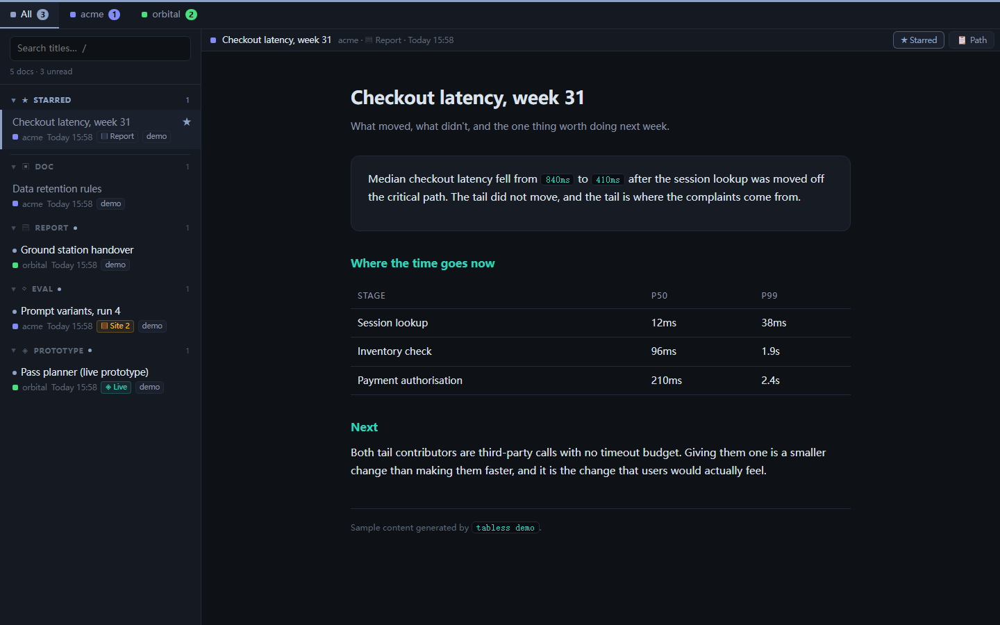
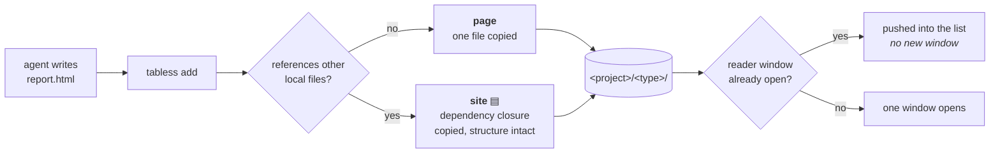
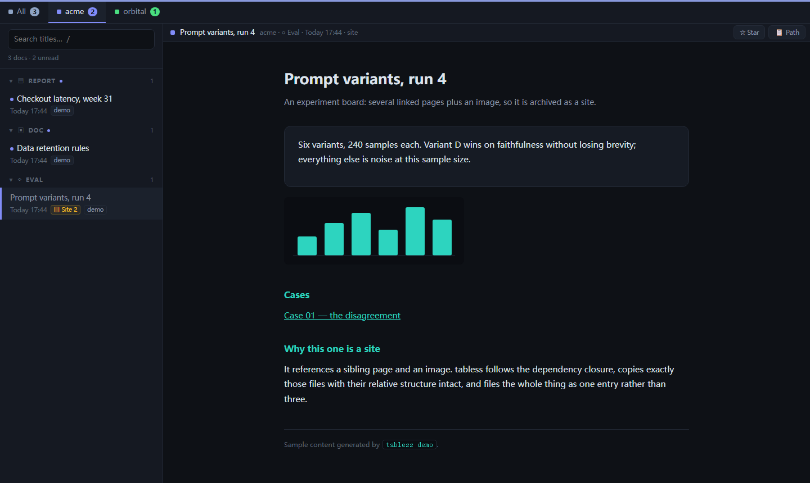
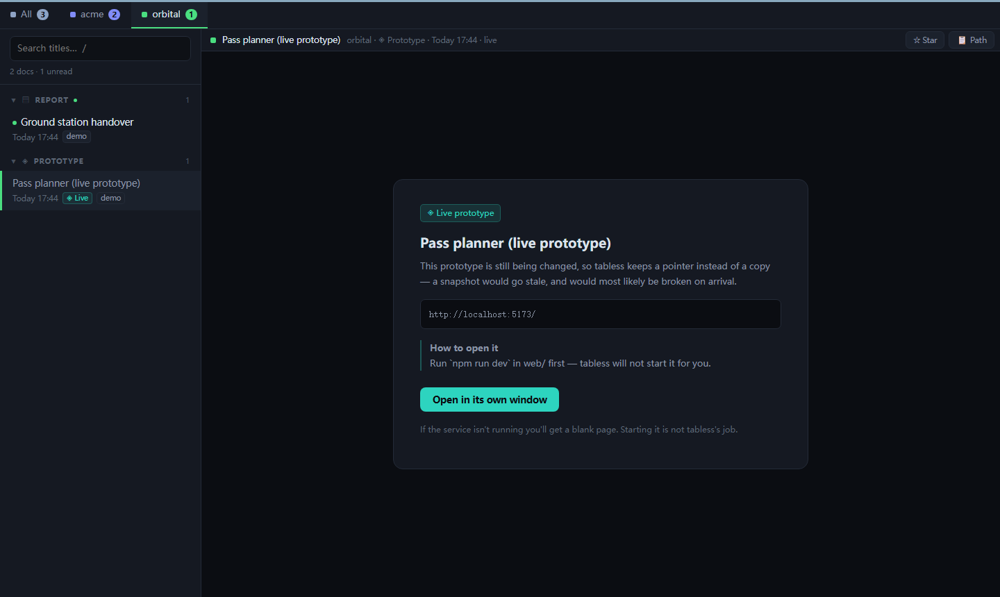

<div align="center">

<h1>tabless</h1>

### Your agents keep writing HTML. This is where it goes.

A local shelf and reader for the HTML your coding agent produces — filed by
project and type, kept as durable copies, and read in **one window that never
becomes another browser tab**.

[](https://github.com/starless0912/tabless/actions/workflows/ci.yml)
[](https://www.python.org/downloads/)
[](LICENSE)
[](pyproject.toml)
[](#install)

**English** · [中文](README.zh-CN.md)

<br>



</div>

---

## The problem

Coding agents got good at writing HTML. Ask for an analysis, a prototype, a
comparison board, and you get back a self-contained page that is genuinely
nicer to read than a wall of terminal output.

Then it lands in a temp directory the OS will eventually clear, or a chat
client's attachment cache, or somewhere deep in a repo — and **the browser tab
becomes the only evidence that it exists.**

So the tab stays open. Then thirty of them stay open, from four different
projects, and they all look identical.

> tabless makes the tab closeable, and stops the next report from opening one.

---

## 30 seconds

```bash
pipx install tabless     # or: pip install tabless
tabless demo             # loads a few samples and opens the reader
```

Then archive something real:

```console
$ tabless add ./analysis.html --type report
[tabless] Added: [acme/report] Checkout latency, week 31
```

That command copies the file into the library, works out which project it
belongs to from its path, and pushes it into the reader window you already have
open. No new window. No new tab.

---

## Then tell your agent about it

**This is the part that matters.** Paste this into the instructions your agent
always reads — `~/.claude/CLAUDE.md`, `AGENTS.md`, wherever your rules live:

```markdown
## Delivering HTML

When you finish something meant to be read — a report, a prototype, a
reference doc, an experiment write-up — write it as HTML and file it:

    tabless add "<path>" --type <type>

Do not open it with `start` / `open` / `xdg-open`, and do not just hand back
the path. Run `tabless types` first and reuse an existing type when one fits.
The test for the type is what the page is *for the reader*, not what it is
about: `report` = read once · `doc` = you'll come back to it ·
`prototype` = something to try · `eval` = a by-product of an experiment.
```

That's the whole integration. **No MCP server, no API key, no plugin** — your
agent already knows how to run a command. The full version, including why
titles matter and when to use `live` instead of `add`, is in
[docs/agent-prompt.md](docs/agent-prompt.md) (English and Chinese).

---

## What it does

|  |  |
|:--|:--|
| **▤ Files it** | `<project>/<type>/` on disk. Project inferred from the path, type is whatever you say it is — an open set, not a fixed menu. |
| **⧉ Keeps a copy** | Not a link. A page referencing images, stylesheets or sibling pages is snapshotted with its dependency closure intact. Delete the original and check. |
| **▢ One window** | New documents are pushed into the window you already have. If they belong to another project, that tab lights up instead of stealing what you're reading. |
| **★ Stars across types** | Pin anything to the top regardless of which group it lives in. Lifted out of its group, never duplicated into two places. |
| **⌨ Keyboard-first** | `j`/`k` documents · `←`/`→` projects · `/` search · `p` star · `c` copy the path back to your agent. |
| **⇄ Bilingual** | English and Chinese throughout — CLI, reader, error pages — following your system locale. |

---

## How it decides what to do



Nothing above is a flag you have to remember. The only thing tabless cannot
work out for itself is whether something is **still changing** — for that there
is `tabless live`, which stores a pointer instead of a copy.

<table>
<tr>
<td width="50%" valign="top">



**▤ site** — references an image and a sibling page, so the closure came
along. It still works with the original long gone.

</td>
<td width="50%" valign="top">



**◈ live** — a prototype you're still editing. A snapshot of a moving target
expires, and usually arrives broken. So: a pointer, and instructions.

</td>
</tr>
</table>

---

## Two axes: project × type

Projects are the tabs across the top. Types are the collapsible groups down the
side. On disk that is literally `<project>/<type>/`.

| type | it holds | the test |
|:--|:--|:--|
| `report` | analysis, progress, retros | read once, then done |
| `prototype` | something interactive | used to try an idea out |
| `doc` | rules, specs, references | you will come back to it |
| `eval` | comparisons, experiment boards | a by-product of an experiment |

The test is **what the page is for the reader**, not what it is about. A
performance analysis is a `report`; a table of retention rules you keep
consulting is a `doc`, even though both are "about the system".

Types are an **open set** — pass `--type postmortem` and you get a `postmortem`
shelf. Common variants (`reports`, `proto`, `wiki`, `文档`) fold onto their
canonical names, and `tabless add` prints the existing types whenever it meets a
new one, so a typo announces itself instead of quietly splitting a shelf in two.

---

## Install

```bash
pipx install tabless
```

Python 3.11+, **no runtime dependencies**, everything stays on `127.0.0.1`.
Works on Windows, macOS and Linux — CI runs the suite on all three across
Python 3.11–3.13.

The reader wants a Chromium-family browser for its `--app` window. If there
isn't one it falls back to your default browser, which works fine but costs a
tab — the one thing this was built to avoid.

<details>
<summary><b>All commands</b></summary>

<br>

```
tabless add <file> --type report      archive and open in the reader
tabless add <file> --title "…"        explicit title (two different things must not share one)
tabless add <file> --no-open          archive only
tabless live <url> --project p --title t --hint "npm run dev first"
tabless list [--project p] [--type t] ▤=site  ◈=live
tabless types                         what's in use — worth a glance before `add`
tabless projects                      projects and unread counts
tabless retype <id> <type>            refile; the copy on disk moves too
tabless scan [dirs...]                adopt HTML already lying around
tabless open [project] | --all        open the reader
tabless where                         where the library and config actually are
tabless demo                          load samples and look at it
tabless server                        run the service in the foreground
```

</details>

<details>
<summary><b>Configuration</b> — where the library lives, port, language, project table</summary>

<br>

| Variable | Default |
|:--|:--|
| `TABLESS_HOME` | `%LOCALAPPDATA%\tabless` · `~/Library/Application Support/tabless` · `$XDG_DATA_HOME/tabless` |
| `TABLESS_PORT` | `6180` |
| `TABLESS_LANG` | your system locale; `en` and `zh` ship, everything else falls back to `en` |
| `TABLESS_MAX_SITE_MB` | `300` — ceiling for one site snapshot; raise it if your bundles genuinely are that big |

For anything permanent, prefer the settings file over an environment variable —
`tabless where` prints its path (`%APPDATA%\tabless\config.toml` or
`$XDG_CONFIG_HOME/tabless/config.toml`):

```toml
home = "D:/my-library"
port = 6180
lang = "zh"
max_site_mb = 300   # snapshot ceiling — a tripwire for a closure gone wrong, not a verdict on big bundles
```

The environment still wins when set. The file exists because a variable is a
fragile place to keep "my library is over there": a shell that never exported it
would silently open an *empty* library somewhere else, and "my documents are
gone" is the worst answer this tool could give.

**Project inference is optional.** Without a table everything lands in `_inbox`,
which is a perfectly good single-tab setup. With one — `projects.toml` inside
`TABLESS_HOME` — paths resolve to projects automatically:

```toml
[projects.acme]
path = "~/code/acme"
tint = "#0d2624"      # optional; a stable colour is derived from the name otherwise

[sources]
yaml = "~/my-workspace-registry.yaml"   # optional: reuse a list you already keep
```

Agent scratchpad paths (`.../claude/<slug>/...`, `~/.claude/projects/<slug>/`)
are reversed back to the project they came from, so `tabless add` usually needs
no flags at all.

</details>

<details>
<summary><b>The reader</b> — keys, groups, what the buttons do</summary>

<br>

|  |  |
|:--|:--|
| Project tabs | colour dot plus unread count; the project with something new lights up |
| Type groups | collapsible, collapse state remembered across restarts |
| ★ Starred | pins **across types** — lifted out of its group, not duplicated |
| Push | a new document slots in and flashes; if it isn't the current tab, only that tab lights up |
| 📋 Path | copies the document's path on disk, ready to paste back to an agent |
| Keys | `j`/`k` documents · `←`/`→` or `1`–`9` projects · `/` search · `p` star · `c` copy path |

One caveat on the shortcuts: once you click into the document on the right, the
iframe swallows keyboard events. Clicking the list brings them back; the buttons
always work.

Every document served gets one shared scrollbar style injected, wrapped in
`@layer` — so a document that styled its own scrollbar keeps its design
untouched, and the ones that never thought about it stop clashing with dark
layouts.

</details>

<details>
<summary><b>Running the service at login</b> — you probably don't need to</summary>

<br>

The service starts on demand; the first `tabless add` brings it up. Autostart
only saves a second of cold start. If you want it anyway, there are recipes for
systemd, launchd and Windows in [docs/autostart.md](docs/autostart.md).

</details>

---

## What it deliberately does not do

- **It does not manage processes.** No supervision, no starting your dev server,
  no port monitoring. A `live` entry whose service isn't running opens blank,
  and that is the design. Cross this line and it grows into a runaway launcher.
- **It does not open a second window.** Every entry point pushes to the one
  window or switches its tab. Several windows would only trade a pile of tabs
  for a pile of windows: that is sorting, not reducing.
- **It does not restyle your documents.** The one injected style is layered so
  it always loses to anything the document defines itself.
- **It does not phone home.** Loopback only, no telemetry, no accounts.

---

## How it compares

|  | what it takes in | what it's for |
|:--|:--|:--|
| [ArchiveBox](https://github.com/ArchiveBox/ArchiveBox) | URLs, bookmarks, history | archiving the public web |
| [SingleFile](https://github.com/gildas-lormeau/SingleFile) | a page in your browser | flattening one page into one file |
| Claude / artifact viewers | React artifacts | running generated components while developing |
| **tabless** | **local HTML your agent just wrote** | **filing and reading deliverables over time** |

Closest in spirit to ArchiveBox, but pointed the other way: the input is already
on your disk, and the output is something you read rather than something you
preserve.

---

## Design notes

The interesting decisions and the traps behind them — why site entries redirect
instead of getting a `<base>` tag, why the index lock is not reentrant, why
deleting a `live` entry needed a guard against deleting the entire library — are
written up in **[docs/design-notes.md](docs/design-notes.md)**.

The test suite is organised around the same list: nearly every case in `tests/`
exists to stop one specific bug coming back, and says so in its docstring.

## Contributing

Bug reports and pull requests are welcome. Please read
[CONTRIBUTING.md](CONTRIBUTING.md) first — it lists the handful of design
constraints that are not up for negotiation, and why each one is there.

## License

MIT © Yifan Huang
