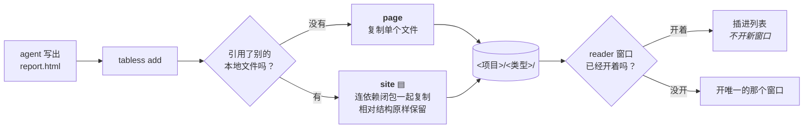

<div align="center">

<h1>tabless</h1>

### 你的 agent 一直在写 HTML。这里是它们的归宿。

给 agent 产出的 HTML 准备的本地书架与阅读器 —— 按项目和类型归档，存的是不会失效的副本，
全部在**同一个窗口**里读，**永远不再产生新的浏览器 tab**。

[](https://github.com/starless0912/tabless/actions/workflows/ci.yml)
[](https://www.python.org/downloads/)
[](LICENSE)
[](pyproject.toml)
[](#安装)

[English](README.md) · **中文**

<br>


</div>

---

## 它解决什么问题

现在的 coding agent 已经很会写 HTML 了。你要一份分析、一个原型、一张对比板，它回给你一个
自包含的页面——确实比一屏终端输出好读得多。

然后这份东西落在了系统迟早会清掉的临时目录里，或者微信的附件缓存里，或者某个仓库深处，
于是**浏览器 tab 成了「我还留着它」的唯一凭证**。

所以那个 tab 关不掉。然后是三十个关不掉的 tab，来自四个不同项目，而且长得一模一样。

> tabless 让你敢关 tab，也让下一份报告不再产生新的 tab。

---

## 30 秒

```bash
pipx install git+https://github.com/starless0912/tabless
tabless demo             # 灌几篇示例并打开 reader
```

然后归档一份真的东西：

```console
$ tabless add ./分析.html --type report
[tabless] 已入库: [acme/report] 结账延迟 · 第 31 周
```

这条命令做了三件事：把文件复制进文库、从路径推断出它属于哪个项目、推进你已经开着的那个
reader 窗口。**不开新窗口，不开新 tab。**

---

## 然后告诉你的 agent

**这才是重点。** 把下面这段粘进你的 agent 每次都会读的那份指令里——
`~/.claude/CLAUDE.md`、`AGENTS.md`，或者你的规则文件在哪就哪：

```markdown
## HTML 交付纪律

凡是产出给人看的东西——报告、原型、参考文档、实验产物——一律写成 HTML 并入库：

    tabless add "<路径>" --type <类型>

不要用 `start` / `open` / `xdg-open` 打开它，也不要只把路径贴回来。入库前先跑
`tabless types` 看现有类型，能复用就复用。类型的判据是「它对读者是什么」，不是
「它讲什么内容」：`report` = 看完就完 · `doc` = 会反复回来查 ·
`prototype` = 用来体验 · `eval` = 实验过程的产物。
```

集成到此为止。**不需要 MCP server，不需要 API key，不需要插件**——你的 agent 本来就会执行
命令。完整版（包括标题为什么重要、什么时候该用 `live` 而不是 `add`）在
[docs/agent-prompt.md](docs/agent-prompt.md)，中英双语。

---

## 它做什么

|  |  |
|:--|:--|
| **▤ 归档** | 落盘 `<项目>/<类型>/`。项目从路径推断，类型你说了算——是开放集合，不是固定菜单。 |
| **⧉ 存副本** | 不是存链接。引用了图片、样式、互链页面的报告，会连同**依赖闭包**一起快照下来。删掉源文件试试。 |
| **▢ 单窗口** | 新文档推进你已经开着的那个窗口。属于别的项目就只点亮那个 tab，不抢走你正在读的东西。 |
| **★ 跨类型置顶** | 星标的东西无视分组直接顶到最上面。是**摘出来**，不是在两处重复出现。 |
| **⌨ 键盘优先** | `j`/`k` 文档 · `←`/`→` 项目 · `/` 搜索 · `g` 分组 · `u` 只看未读 · `p` 星标 · `c` 复制路径直接粘给 agent。 |
| **⇄ 中英双语** | 命令行、界面、错误页全都双语，跟随系统语言自动切换。 |

---

## 它怎么自己做判断



上面这些都不是你要记的参数。tabless 唯一自己判断不了的是**这东西还会不会变**——
那用 `tabless live`，只存指针不存副本。

<table>
<tr>
<td width="50%" valign="top">


**▤ 整站** —— 引用了一张图和一个互链页，所以闭包一起搬了进来。源文件早没了它照样能看。

</td>
<td width="50%" valign="top">


**◈ 活体** —— 还在改的原型。给移动目标存快照会过期，而且多半一开始就是坏的。
所以：一个指针，加一句怎么启动。

</td>
</tr>
</table>

---

## 两个维度：项目 × 类型

项目是顶部的 tab，类型是左栏可折叠的分组。落盘就是 `<项目>/<类型>/`。

左栏也可以改成按时间分组——今天、三天内、七天内、更早——类型在每一档内部排开。
这是回答"今天出了什么"的视图：否则同一天的报告和实验会被切进两个类型组，而这两个
组早就飘到列表的两个地方去了。两种分组只影响列表怎么画，存储不受影响。

| 类型 | 装什么 | 判据 |
|:--|:--|:--|
| `report` | 分析、进展、复盘 | 一次性，看完就完 |
| `prototype` | 可交互的东西 | 用来体验和验证 |
| `doc` | 规则书、规范、正典 | 会反复回来查 |
| `eval` | 盲评、对比、实验站 | 实验过程的产物 |

判据是**「它对读者是什么」，不是「它讲什么内容」**。一份性能分析是 `report`；一张你会反复
回来查的留存规则表是 `doc`——尽管两者都「关于同一个系统」。

类型是**开放集合**——传 `--type postmortem` 就会长出一个 `postmortem` 架子。常见的变体
（`reports`、`proto`、`wiki`、`文档`）会自动归一到规范名；而 `tabless add` 每次遇到没见过的
类型都会把现有类型列出来，好让拼错的名字当场暴露，而不是无声地把一个架子劈成两个。

---

## 安装

```bash
pipx install git+https://github.com/starless0912/tabless    # 或者 pip install git+…
```

还没上 PyPI，所以从仓库装——`pip install tabless` 是找不到的。要参与开发就 clone
下来 `pip install -e .`。

Python 3.11+，**零运行时依赖**，只绑 `127.0.0.1`。Windows / macOS / Linux 都能跑，
CI 在三个系统 × Python 3.11–3.13 上跑测试。

reader 需要一个 Chromium 系浏览器来开 `--app` 独立窗口。没有的话会退回默认浏览器——
功能不打折，但会占一个 tab，而那正是这个工具想消灭的东西。

<details>
<summary><b>全部命令</b></summary>

<br>

```
tabless add <文件> --type report      入库并在 reader 中打开
tabless add <文件> --title "…"        显式标题（两份不同的东西不能共用一个）
tabless add <文件> --no-open          只入库，不打开
tabless live <地址> --project p --title t --hint "先 npm run dev"
tabless list [--project p] [--type t] ▤=整站  ◈=活体
tabless types                         看现有类型——add 之前值得照一眼
tabless projects                      项目与未读数
tabless retype <id> <类型>            改归类，磁盘副本一并挪目录
tabless scan [目录...]                批量收编散落在外的 HTML
tabless open [项目] | --all           打开 reader
tabless where                         库与配置到底在哪
tabless demo                          灌示例，看看效果
tabless server                        在前台跑服务
```

</details>

<details>
<summary><b>配置</b> —— 文库位置、端口、语言、项目表</summary>

<br>

| 环境变量 | 默认值 |
|:--|:--|
| `TABLESS_HOME` | `%LOCALAPPDATA%\tabless` · `~/Library/Application Support/tabless` · `$XDG_DATA_HOME/tabless` |
| `TABLESS_PORT` | `6180` |
| `TABLESS_LANG` | 跟随系统语言；内置 `en` 与 `zh`，其余一律退回 `en` |

**要长期生效，用配置文件而不是环境变量**——路径见 `tabless where`
（`%APPDATA%\tabless\config.toml` 或 `$XDG_CONFIG_HOME/tabless/config.toml`）：

```toml
home = "D:/my-library"
port = 6180
lang = "zh"
```

环境变量设了仍然优先。之所以要有这个文件：环境变量是个很脆的地方来记「我的文库在别处」
——某个从没 export 过它的 shell 会**静默地在默认位置开一个空库**，而「我的文档不见了」
是这个工具能给出的最糟糕的答案。

**项目推断是可选的。** 没有项目表，一切进 `_inbox`——对单项目工作流这是个完全够用的
单 tab 配置。有项目表的话（`TABLESS_HOME` 下的 `projects.toml`），路径会自动解析到项目：

```toml
[projects.acme]
path = "~/code/acme"
tint = "#0d2624"      # 可选；不填则按项目名派生一个稳定的颜色

[sources]
yaml = "~/我已有的项目清单.yaml"   # 可选：复用你本来就在维护的那份列表
```

agent 的 scratchpad 路径（`.../claude/<slug>/...`、`~/.claude/projects/<slug>/`）会被反解回
它所属的项目，所以 `tabless add` 通常一个参数都不用带。

</details>

<details>
<summary><b>Reader</b> —— 快捷键、分组、按钮都干什么</summary>

<br>

|  |  |
|:--|:--|
| 项目 tab | 项目色点 + 未读数；哪个项目有新东西，哪个 tab 亮 |
| 分组方式 | **按类型**（默认），或**按时间**——今天 · 三天内 · 七天内 · 更早，每档内部再按类型排开；`g` 或右下角一键切换，选过就记住 |
| 分组 | 可折叠，折叠状态跨重启记住 |
| 类型筛选 | 点一下只看这一类，Ctrl 点击可多选；chips 由文库里实际有的类型生成 |
| ● 未读 | 只看还没点开过的；读过的会留在原位，直到你关掉这个开关 |
| ★ 星标 | **跨类型置顶**——从原分组里摘出来，不重复出现 |
| 推送 | 新文档插进列表闪一下；不属于当前 tab 就只点亮对应 tab。推送会撑开正生效的筛选，而不是被它挡住 |
| 📋 路径 | 复制这份文档在磁盘上的路径，可以直接粘给 agent |
| 快捷键 | `j`/`k` 文档 · `←`/`→` 或 `1`–`9` 项目 · `/` 搜索 · `g` 分组 · `u` 只看未读 · `p` 星标 · `c` 复制路径 |

快捷键有一个限制：鼠标点进右边正文之后，键盘事件被 iframe 里的文档吃掉，快捷键会失灵。
点一下左边列表就回来了，按钮任何时候都能点。

每一份服务出去的文档都会被注入一套统一的滚动条样式，外面包着 `@layer`——所以自己定义过
滚动条的文档原样保留自己的设计，而那些从没管过滚动条的不再和深色版面打架。

</details>

<details>
<summary><b>开机自启</b> —— 你多半不需要</summary>

<br>

服务是按需拉起的，第一次 `tabless add` 就会把它起起来。自启只省下一秒冷启动。
真要配的话，systemd / launchd / Windows 三种写法在 [docs/autostart.md](docs/autostart.md)。

</details>

---

## 它刻意不做的事

- **不管进程生命周期。** 不做进程管理、不帮你启动 dev server、不监控端口。服务没跑的
  `live` 条目打开就是空白页，这是设计。越过这条线它会长成一个失控的启动器。
- **不开第二个窗口。** 任何入口都只会推给那唯一的窗口，或者切它的 tab。多窗口只是把 tab
  堆换成窗口堆——那是分类，不是收敛。
- **不改写你的文档样式。** 唯一注入的那段样式带 `@layer`，永远输给文档自己定义的规则。
- **不联网。** 只绑回环地址，没有遥测，没有账号。

---

## 和别的东西比

|  | 输入是什么 | 用来干什么 |
|:--|:--|:--|
| [ArchiveBox](https://github.com/ArchiveBox/ArchiveBox) | URL、书签、浏览历史 | 归档公网网页 |
| [SingleFile](https://github.com/gildas-lormeau/SingleFile) | 你浏览器里的当前页 | 把一个页面压成一个文件 |
| Claude / artifact 查看器 | React artifact | 开发时把生成的组件跑起来 |
| **tabless** | **你的 agent 刚写出来的本地 HTML** | **长期归档并阅读交付物** |

精神上最接近 ArchiveBox，但方向相反：输入本来就在你的磁盘上，输出是拿来**读**的，
而不是拿来**保存**的。

---

## 设计笔记

那些有意思的决定和它们背后的坑——为什么 site 条目用 302 重定向而不是注入 `<base>` 标签、
为什么索引锁不可重入、为什么删除 `live` 条目需要专门防护「删掉整个文库」——都写在
**[docs/design-notes.md](docs/design-notes.md)** 里。

测试套件也是照着同一张清单组织的：`tests/` 里几乎每一个用例都是为了挡住一个具体的
历史 bug，而且在 docstring 里写明了它当年是怎么炸的。

## 参与

欢迎提 issue 和 PR。动手前请先看 [CONTRIBUTING.md](CONTRIBUTING.md)——里面列了几条不接受
讨价还价的设计约束，以及每一条各自是踩了什么坑才定下来的。

## 许可

MIT © Yifan Huang
