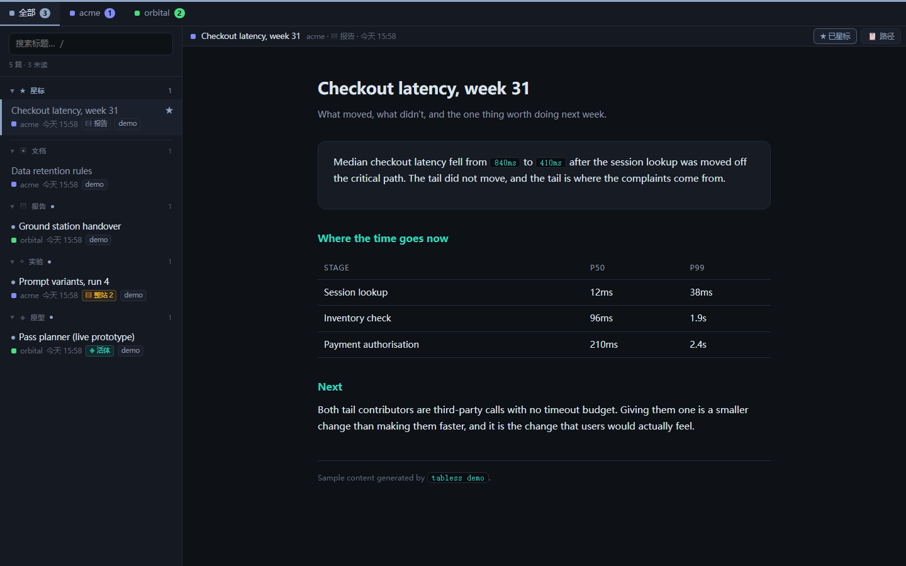

<div align="center">

# tabless

**你的 agent 一直在写 HTML。这里是它们的归宿。**

给 agent 产出的 HTML 准备的本地书架与阅读器 —— 按项目和类型归档，存的是不会失效的
副本，全部在同一个窗口里读，永远不再多开一个浏览器 tab。

[](https://github.com/starless0912/tabless/actions/workflows/ci.yml)
[](https://www.python.org/downloads/)
[](LICENSE)
[](pyproject.toml)

[English](README.md) · [中文](README.zh-CN.md)

</div>



## 它解决什么问题

现在的 coding agent 已经很会写 HTML 了。你要一份分析、一个原型、一张对比板，它回给你
一个自包含的页面——确实比一屏终端输出好读得多。

然后这份东西落在了系统迟早会清掉的临时目录里，或者微信的附件缓存里，或者某个仓库深处，
于是**浏览器 tab 成了「我还留着它」的唯一凭证**。所以那个 tab 关不掉。然后是三十个
关不掉的 tab，来自四个不同项目，而且长得一模一样。

tabless 让你敢关 tab，也让下一份报告不再产生新的 tab。

## 它做三件事

- **归档。** 落盘是 `<项目>/<类型>/`，reader 里是顶部 tab 加左栏分组。项目从路径推断，
  类型你说了算。
- **存副本，不存链接。** 引用了图片、样式、互链页面的报告会连同**依赖闭包**一起快照
  下来，相对结构原样保留，所以源文件没了它照样打得开。删掉源文件试试。
- **永远只有一个窗口。** 新文档推进你已经开着的那个 reader 窗口。如果它属于别的项目，
  就只把那个项目的 tab 点亮，不抢走你正在读的东西。

## 安装

```bash
pipx install tabless          # 或者 pip install tabless
tabless demo                  # 灌几篇示例并打开 reader
```

Python 3.11+，零运行时依赖，只绑 `127.0.0.1`。reader 需要一个 Chromium 系浏览器来开
`--app` 独立窗口——没有的话会退回默认浏览器，功能不打折，只是会占一个 tab。

## 接上你的 agent

**这才是重点。** 把下面这段粘进你的 agent 每次都会读的那份指令里
（`~/.claude/CLAUDE.md`、`AGENTS.md`，或者你的规则文件在哪就哪）：

```markdown
## HTML 交付纪律

凡是产出给人看的东西——报告、原型、参考文档、实验产物——一律写成 HTML 并入库：

    tabless add "<路径>" --type <类型>

不要用 `start` / `open` / `xdg-open` 打开它，也不要只把路径贴回来。入库前先跑
`tabless types` 看现有类型，能复用就复用。类型的判据是「它对读者是什么」，不是
「它讲什么内容」：`report` = 看完就完 · `doc` = 会反复回来查 ·
`prototype` = 用来体验 · `eval` = 实验过程的产物。
```

完整版——包括标题为什么重要、什么时候该用 `live` 而不是 `add`——在
**[docs/agent-prompt.md](docs/agent-prompt.md)**，中英双语。

集成到此为止。不需要 MCP server，不需要 API key，不需要插件：你的 agent 本来就会执行
命令。

## 归档规则

### 两个维度：项目 × 类型

落盘就是 `<项目>/<类型>/`。reader 里项目是顶部的 tab，类型是左栏可折叠的分组。

| 类型 | 装什么 | 判据 |
|---|---|---|
| `report` | 分析、进展、复盘 | 一次性，看完就完 |
| `prototype` | 可交互的东西 | 用来体验和验证 |
| `doc` | 规则书、规范、正典 | 会反复回来查 |
| `eval` | 盲评、对比、实验站 | 实验过程的产物 |

判据是**「它对读者是什么」，不是「它讲什么内容」**。一份性能分析是 `report`；一张你
会反复回来查的留存规则表是 `doc`——尽管两者都「关于同一个系统」。

类型是**开放集合**——传 `--type postmortem` 就会长出一个 `postmortem` 架子。常见的
变体（`reports`、`proto`、`wiki`、`文档`）会自动归一到规范名；而 `tabless add` 每次
遇到没见过的类型都会把现有类型列出来，好让拼错的名字当场暴露，而不是无声地把一个架子
劈成两个。

### 三种条目

判据不是「是不是 HTML」，而是**离开原地还能不能看**，以及**它还会不会变**：

| 类型 | 是什么 | 怎么存 |
|---|---|---|
| `page` | 自包含单页 | 复制单个文件 |
| `site` ▤ | 引用了图片、样式、互链页面 | 存**依赖闭包**，相对结构原样保留 |
| `live` ◈ | 还在改的原型 | **只存指针** |

`page` 还是 `site` 是自动判断的——解析入口文件真正引用了什么。只收闭包内的文件而不是
整个目录：实验站的 `goldens/` 可能有 25M 图片，而一个详情页只用到其中十四张。

`live` 必须手动登记，因为**给还在改的东西存快照比没存更糟**：你留下的是一个会过期的
副本，而且多半从一开始就是坏的——它依赖的样式表根本不在快照找过的地方。

## Reader

|  |  |
|---|---|
| 项目 tab | 项目色点 + 未读数；哪个项目有新东西，哪个 tab 亮 |
| 类型分组 | 可折叠，折叠状态跨重启记住 |
| ★ 星标 | **跨类型置顶**——从原分组里摘出来，不在两处重复出现 |
| 推送 | 新文档插进列表闪一下；不属于当前 tab 就只点亮对应 tab |
| 📋 路径 | 复制这份文档在磁盘上的路径，可以直接粘给 agent |
| 快捷键 | `j`/`k` 文档 · `←`/`→` 或 `1`–`9` 项目 · `/` 搜索 · `p` 星标 · `c` 复制路径 |

每一份服务出去的文档都会被注入一套统一的滚动条样式，外面包着 `@layer`——所以自己定义
过滚动条的文档原样保留自己的设计，而那些从没管过滚动条的不再和深色版面打架。

## 命令

```
tabless add <文件> --type report      入库并在 reader 中打开
tabless add <文件> --title "…"        显式标题（两份不同的东西不能共用一个）
tabless add <文件> --no-open          只入库，不打开
tabless live <地址> --project p --title t --hint "先 npm run dev"
tabless list [--project p] [--type t] ▤=整站  ◈=活体
tabless types                         看现有类型——add 之前值得照一眼
tabless projects                      项目与未读数
tabless retype <id> <类型>            改归类，磁盘副本一并挪目录
tabless scan [目录...]                批量收编散落在外的 HTML
tabless open [项目] | --all           打开 reader
tabless where                         库与配置到底在哪
tabless demo                          灌示例，看看效果
```

## 配置

| 环境变量 | 默认值 |
|---|---|
| `TABLESS_HOME` | `%LOCALAPPDATA%\tabless` · `~/Library/Application Support/tabless` · `$XDG_DATA_HOME/tabless` |
| `TABLESS_PORT` | `6180` |
| `TABLESS_LANG` | 跟随系统语言；内置 `en` 与 `zh`，其余一律退回 `en` |

项目推断是可选的。没有项目表，一切进 `_inbox`——对单项目工作流这是个完全够用的单 tab
配置。有项目表的话（`TABLESS_HOME` 下的 `projects.toml`，位置见 `tabless where`），
路径会自动解析到项目：

```toml
[projects.acme]
path = "~/code/acme"
tint = "#0d2624"      # 可选；不填则按项目名派生一个稳定的颜色
```

agent 的 scratchpad 路径（`.../claude/<slug>/...`、`~/.claude/projects/<slug>/`）会被
反解回它所属的项目，所以 `tabless add` 通常一个参数都不用带。

## 它刻意不做的事

- **不管进程生命周期。** 不做进程管理、不帮你启动 dev server、不监控端口。服务没跑的
  `live` 条目打开就是空白页，这是设计。越过这条线它会长成一个失控的启动器。
- **不开第二个窗口。** 任何入口都只会推给那唯一的窗口，或者切它的 tab。多窗口只是把
  tab 堆换成窗口堆——那是分类，不是收敛。
- **不改写你的文档样式。** 唯一注入的那段样式带 `@layer`，永远输给文档自己定义的规则。
- **不联网。** 只绑回环地址，没有遥测，没有账号。

## 和别的东西比

| | 输入是什么 | 用来干什么 |
|---|---|---|
| [ArchiveBox](https://github.com/ArchiveBox/ArchiveBox) | URL、书签、浏览历史 | 归档公网网页 |
| [SingleFile](https://github.com/gildas-lormeau/SingleFile) | 你浏览器里的当前页 | 把一个页面压成一个文件 |
| Claude / artifact 查看器 | React artifact | 开发时把生成的组件跑起来 |
| **tabless** | **你的 agent 刚写出来的本地 HTML** | **长期归档并阅读交付物** |

精神上最接近 ArchiveBox，但方向相反：输入本来就在你的磁盘上，输出是拿来**读**的，
而不是拿来**保存**的。

## 设计笔记

那些有意思的决定和它们背后的坑——为什么 site 条目用 302 重定向而不是注入 `<base>`
标签、为什么索引锁不可重入、为什么删除 `live` 条目需要专门防护「删掉整个文库」——都
写在 **[docs/design-notes.md](docs/design-notes.md)** 里。测试套件也是照着同一张清单
组织的。

## 参与

欢迎提 issue 和 PR。动手前请先看 [CONTRIBUTING.md](CONTRIBUTING.md)——里面列了几条
不接受讨价还价的设计约束，以及每一条各自是踩了什么坑才定下来的。

## 许可

MIT。
